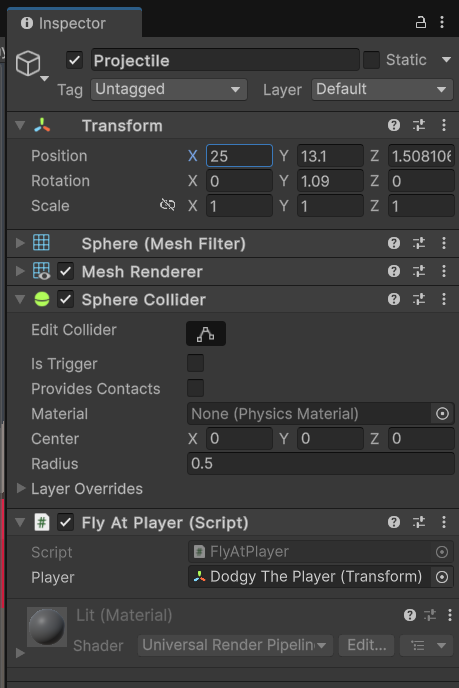

# DOging game engine c#

## moving box/player - scripts on player

```csharp
using UnityEngine;

public class Mover : MonoBehaviour
{
    // Start is called once before the first execution of
    // Update after the MonoBehaviour is created
    void Start()
    {
        //transform.Translate(1, 0 ,0);// immediately pops 1 unit to right when play is pressed
    }

    // Update is called once per frame
    void Update()
    {
        transform.Translate(0.01f, 0 ,0);//for every frame moves 0.01 
    }
}
```

## variables

```csharp
using UnityEngine;

public class Mover : MonoBehaviour
{
    float xValue = 0.01f;
    float yValue = 0.01f;
    float zValue = 0.01f;
    // Start is called once before the first execution of Update after the MonoBehaviour is created
    void Start()
    {
        //transform.Translate(1, 0 ,0);// immediately pops 1 unit to right when play is pressed
    }

    // Update is called once per frame
    void Update()
    {
        transform.Translate(xValue , yValue , zValue);
    }
}

```

## serialize - give me sliders in the inspector to chnage the variable

```csharp
using UnityEngine;

public class Mover : MonoBehaviour
{
    [SerializeField] float xValue = 0f;
    [SerializeField] float yValue = 0f;
    [SerializeField] float zValue = 0f;
    // Start is called once before the first execution of Update after the MonoBehaviour is created
    void Start()
    {
        //transform.Translate(1, 0 ,0);// immediately pops 1 unit to right when play is pressed
    }

    // Update is called once per frame
    void Update()
    {
        transform.Translate(xValue , yValue , zValue);
    }
}

```

## Avoid reloading each time play is clicked

- Project setting → Editor → Enter play mode setting - reload domain and scene

## simple movement

- WASD system
- old input system
- Edit → Project Settings → input manager → see input system

```csharp
    using UnityEngine;

public class Mover : MonoBehaviour
{
    // Start is called once before the first execution of Update after the MonoBehaviour is created
    void Start()
    {
        //transform.Translate(1, 0 ,0);// immediately pops 1 unit to right when play is pressed
    }

    // Update is called once per frame
    void Update()
    {
        float xValue = Input.GetAxis("Horizontal");
        float yValue = 0;
        float zValue = Input.GetAxis("Vertical");
        transform.Translate(xValue , yValue , zValue);
    }
}

```

this moves way too fast with no ctrl, so we need tie to frame rate

Player needs to have consistent fram rate

## Time.deltaTime

- multiply movement with this to attach to frame rate
- then multiply with a variable which is serizlized to find out speed

```csharp
    using UnityEngine;

public class Mover : MonoBehaviour
{
    [SerializeField] float moveSpeed = 10f;
    // Start is called once before the first execution of Update after the MonoBehaviour is created
    void Start()
    {
        //transform.Translate(1, 0 ,0);// immediately pops 1 unit to right when play is pressed
    }

    // Update is called once per frame
    void Update()
    {
        
        float xValue = Input.GetAxis("Horizontal")*Time.deltaTime*moveSpeed;
        float yValue = 0;
        float zValue = Input.GetAxis("Vertical")*Time.deltaTime*moveSpeed;
        transform.Translate(xValue , yValue , zValue);
    }
}

```

## Cinemachine

- powerful unity package
- Cinemachine brain - ctrl many virtual cameras - like one for running, one for cutscene
- Windows → Package manager → unity register → install cinemachine

- Heirarchy RL → cinmachine → cinemachine camera
    - CLick on cinemachine - then inspector window
    - Tracking target -player
    - Positional ctrl -  Follow
    - Rotationa;l control - Jard look at
    - CInemachine follwo -
        - Follow offset Y val change to be up
        - Dampening  - how long to catch up

## COllisions to walls and boundary

- Inspector → Player obj → Add component → Rigid body
    - remove use gravity
    - frezze pos, rot
- FOr walls  - Box collidor
    - edit collidor - to change si\ze of collidor to create a buffer
    - if IsTrigger is checked - iut will be invisible - but if player goes through it , some action can happen

## methods

- done outside of start() and ipdate() methofs

```csharp
using UnityEngine;

public class Mover : MonoBehaviour
{
    [SerializeField] float moveSpeed = 20f;
    // Start is called once before the first execution of Update after the MonoBehaviour is created
    void Start()
    {
        //transform.Translate(1, 0 ,0);// immediately pops 1 unit to right when play is pressed
        PrintInstructions();
    }

    // Update is called once per frame
    void Update()
    {
        MovePlayer();
    }

    void PrintInstructions(){
        Debug.Log("Welcome to the game");
        Debug.Log("Move using WASD");
        Debug.Log("DOnt bump into obj" + Time.deltaTime);
    }

    void MovePlayer(){
        float xValue = Input.GetAxis("Horizontal")*Time.deltaTime*moveSpeed;
        float yValue = 0;
        float zValue = Input.GetAxis("Vertical")*Time.deltaTime*moveSpeed;
        transform.Translate(xValue , yValue , zValue);
    }
}

```

## object hit

- create new C# mono behaviour - select walls and obstacles, and add object hit as new compnenr
- delete start and update - not needed
- when collider hit gives message

```csharp
using UnityEngine;

public class ObjectHit : MonoBehaviour
{
    private void OnCollisionEnter(Collision other) {
        Debug.Log("Something hit me");
    }
}

```

# get component

- change color when thing hits
- using get component - we can get to know objects info like mesh renderer

```csharp
using UnityEngine;

public class ObjectHit : MonoBehaviour
{
    private void OnCollisionEnter(Collision other) {
        GetComponent<MeshRenderer> ().material.color = Color.red;
        Debug.Log("Something hit me");
    }
}

```

## keeping score

assigned to playewr as new script

Scorer.cs

```csharp
using UnityEngine;

public class Scorer : MonoBehaviour
{
    // Start is called once before the first execution of Update after the MonoBehaviour is created
    int hits = 0;
    private void OnCollisionEnter(Collision other) {
        hits = hits+1;
        Debug.Log("I have hit " + hits + "many times" );
    }
}

```

# Time.time

Duplicate obstacle object

Assign script dropper

```csharp
using UnityEngine;

public class Dropper : MonoBehaviour
{
    [SerializeField] float timeToWait = 3.0f;
    // Start is called once before the first execution of Update after the MonoBehaviour is created
    void Start()
    {
        
    }

    // Update is called once per frame
    void Update()
    {
        //Debug.Log(Time.time+"   secs");
        if (Time.time > timeToWait){
            Debug.Log("Look out below");
        }
    }
}

```

# Caching a reference to a component

Add component [ rigidbofy ] to the dropping object 

Use gravidy g

- [x]  gravity

object falls down

mesh renderer 

- [ ]  object is invisible

What we want → after certain amt of time it iws visible and falls down

Dropper.cs

```csharp
using UnityEngine;

public class Dropper : MonoBehaviour
{
    [SerializeField] float timeToWait = 3.0f;
    // Start is called once before the first execution of Update after the MonoBehaviour is created

    MeshRenderer myMeshRenderer ;
    Rigidbody myRigidbody;
    void Start()
    {
        myMeshRenderer = GetComponent<MeshRenderer> ();
        myMeshRenderer.enabled = false;

        myRigidbody =  GetComponent<Rigidbody> ();
        myRigidbody.useGravity = false;

    }

    // Update is called once per frame
    void Update()
    {
        //Debug.Log(Time.time+"   secs");
        if (Time.time > timeToWait){
            //Debug.Log("Look out below");
            myMeshRenderer.enabled=true;
            myRigidbody.useGravity=true;
        }
    }
}

```

# tags

now we are making it so that score increases only once every time - right now if it its multiple times , score keeps going up

CLick on [layer → Inspector → showing untagged

Tag allows us to tell what is a thing

Unragged → Player

now  go to Objecgt hit and say only do this stuff if player hits

Chages color only if player hits - ObjectHit.cs

```csharp
using UnityEngine;

public class ObjectHit : MonoBehaviour
{
    private void OnCollisionEnter(Collision other) {

        if (other.gameObject.tag == "Player") {
            GetComponent<MeshRenderer>().material.color = Color.red;
            Debug.Log("Something hit me");
        }
    }
}

```

Now score only increases if it hits first time

go to obstacle→ tag-⇒ add new tag ⇒ + name it as Hit

Now this code will show that, change my color and give me a new tag called “Hit”

```csharp
using UnityEngine;

public class ObjectHit : MonoBehaviour
{
    private void OnCollisionEnter(Collision other) {

        if (other.gameObject.tag == "Player") {
            GetComponent<MeshRenderer>().material.color = Color.red;
            Debug.Log("Something hit me");
            gameObject.tag = "Hit";
        }
    }
}
```

Now in scorer.cs = only if thing doesnt have hit tag  - score increases

```csharp
using UnityEngine;

public class Scorer : MonoBehaviour
{
    // Start is called once before the first execution of Update after the MonoBehaviour is created
    int hits = 0;
    private void OnCollisionEnter(Collision other) {
        if (other.gameObject.tag != "Hit") {
        hits = hits+1;
        Debug.Log("I have hit " + hits + "many times" );
        }
    }
}

```

# Make objects rotate

Create a object

- assign objecthit script
- assign a anew stript rotate for rotation

```csharp
using UnityEngine;

public class Spinner : MonoBehaviour
{
    // Start is called once before the first execution of Update after the MonoBehaviour is created
    [SerializeField] float xRotSpeed = 0;
    [SerializeField] float yRotSpeed = 0;
    [SerializeField] float zRotSpeed = 0;
    void Start()
    {
        
    }

    // Update is called once per frame
    void Update()
    {
        transform.Rotate(xRotSpeed, yRotSpeed, zRotSpeed);  
        
    }
}

```

now we can assign this script to any object

# FLy at PLayer

## Vector 3

- fly at player
- MoveTOwards(current, target, maxDistanceDelta -(distance to move each time))

```csharp
using UnityEngine;

public class FlyAtPlayer : MonoBehaviour
{
    // Start is called once before the first execution of Update after the MonoBehaviour is created

    [SerializeField] Transform player;
    [SerializeField] float  movementTowardsPlayerSpeed = 0.1f;
    Vector3 playerPosition;
    void Start()
    {
        playerPosition = player.transform.position;
    }

    // Update is called once per frame
    void Update()
    {
        transform.position = Vector3.MoveTowards(transform.position, playerPosition, movementTowardsPlayerSpeed*Time.deltaTime);
    }
}

```



- Trandform player serialized field - select player object form drop down menu
- movement towards is time independent hence it is shown as


# Destroy game objects

- Destroy game objects once they do not serve their purpose
- DUplicate the fly at sphere objects - projectile   -alter speed from the inspector window

Fly At PLayer. cs

```csharp
using UnityEngine;

public class FlyAtPlayer : MonoBehaviour
{
    // Start is called once before the first execution of Update after the MonoBehaviour is created

    [SerializeField] Transform player;
    [SerializeField] float  movementTowardsPlayerSpeed = 0.1f;
    Vector3 playerPosition;
    void Start()
    {
        playerPosition = player.transform.position;
    }

    // Update is called once per frame
    void Update()
    {
        flyToPLayer();
        DestroyWhenReached();
    }

    void flyToPLayer(){
        transform.position = Vector3.MoveTowards(transform.position, playerPosition, movementTowardsPlayerSpeed*Time.deltaTime);
    }

    void DestroyWhenReached(){
        if (transform.position == playerPosition){
        Destroy(gameObject);
        }
    }
}

```

Also some things arranged into a wfunction

# Trigger projectile

- when we move through trigger volume ⇒ triggers object to fly at playter
- Create cube
    - turn off mesh renderer
    - Box Collider - Turn on Is Trigger

```csharp
using UnityEngine;

public class TriggerProjectile : MonoBehaviour
{
    [SerializeField] GameObject projectile;
    void OnTriggerEnter(Collider other)
    {
        if (other.gameObject.tag == "Player"){
            projectile.SetActive(true);
        }
    }
}

```


reference one projectile in triggervolume, the rest disable

Now do the same for the rest of the triiggers

```csharp
using UnityEngine;

public class TriggerProjectile : MonoBehaviour
{
    [SerializeField] GameObject projectile;
    [SerializeField] GameObject projectile1;
    [SerializeField] GameObject projectile2;
    [SerializeField] GameObject projectile3;
    
    void OnTriggerEnter(Collider other)
    {
        if (other.gameObject.tag == "Player"){
            projectile.SetActive(true);
            projectile1.SetActive(true);
            projectile2.SetActive(true);
            projectile3.SetActive(true);
            
        }
    }
}
```

# Prefab

Quick Definitions
• Prefab: reusable asset that represents a GameObject
• Instance: specific copy of a prefab in our scene

to avoid problems of brute forcing projectiles

Create porefabs folder

Drag Projectile object into prefabs folder

TO increase prefab asset size - double click on preffab - new wwindow can increase

Also u can make change to one instance and app that to all ion the inspector window


Prefab anything you can frefab

But after prefabbing need to recheck connections

# order of execution

Now to avoid pain of manually setting active or not ,we will now make sure that the setting inactive is done in code

Make GameObjects Inactive
• We want to make sure that we have some code to stop our projectiles from being active when we start our game
• Add one line of code to Start() that ensures our projectiles start as inactive.
• Note: we have a bug that we'll fix after the challenge

Check in unitydocumentation

# cleaning up

- trigger volume is destroyed so that when you try to enter again, when u try to enter again, it doesnt show error

```csharp
using UnityEngine;

public class TriggerProjectile : MonoBehaviour
{
    [SerializeField] GameObject projectile;
    [SerializeField] GameObject projectile1;
    [SerializeField] GameObject projectile2;
    [SerializeField] GameObject projectile3;
    
    void OnTriggerEnter(Collider other)
    {
        if (other.gameObject.tag == "Player"){
            projectile.SetActive(true);
            projectile1.SetActive(true);
            projectile2.SetActive(true);
            projectile3.SetActive(true);
            Destroy(gameObject);
        }
    }
}

```

Also add Object hit.cs to change color for projectiles in PREFAB


https://qiita.com/youtoy/items/c416a44530dab79e8340
https://dev.to/works_ai_makoto_a67a7ff7e/use-ai-tools-with-wsl-step-by-step-guide-to-installing-dify-on-windows-11-2doe
https://tech-study-blog.com/wsl2%E3%81%A7dify%E3%82%92%E4%BD%BF%E3%81%86/
https://zenn.dev/yakumo3/articles/415f83ed3f7cb7
https://zenn.dev/shintaroamaike/articles/8a63bdb7dad992


https://note.com/itella/n/n28ecccdb72e3
